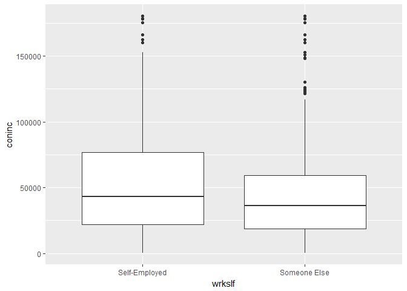
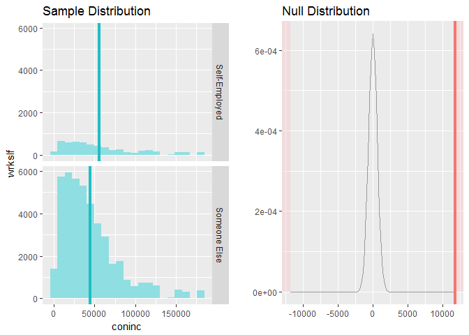
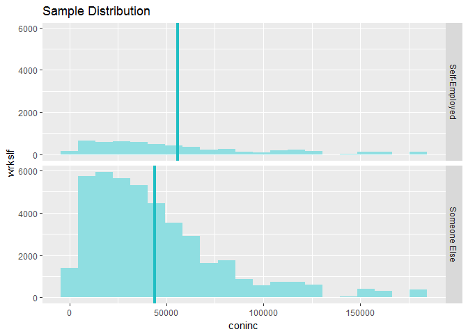

------------------------------------------------------------------------

title: "Statistical inference with the GSS data" output: md\_document
---

Setup
-----

### Load packages

    library(ggplot2)

    ## Warning: package 'ggplot2' was built under R version 3.3.3

    library(dplyr)

    ## Warning: package 'dplyr' was built under R version 3.3.3

    library(statsr)

### Load data

    load("gss.Rdata")

------------------------------------------------------------------------

Exploratory data analysis
-------------------------

    gss_filtered <- filter(gss, !is.na(wrkslf))

    ggplot(data = gss_filtered, mapping=aes(x = wrkslf, y = coninc))+geom_boxplot()

    ## Warning: Removed 5159 rows containing non-finite values (stat_boxplot).

------------------------------------------------------------------------

Inference
---------

    inference(y = coninc, x = wrkslf, data = gss, statistic = "mean", type = "ht", null = 0,  alternative = "twosided", method = "theoretical")

    ## Response variable: numerical
    ## Explanatory variable: categorical (2 levels) 
    ## n_Self-Employed = 5461, y_bar_Self-Employed = 55964.7405, s_Self-Employed = 44317.9211
    ## n_Someone Else = 42929, y_bar_Someone Else = 44138.5354, s_Someone Else = 34614.9788
    ## H0: mu_Self-Employed =  mu_Someone Else
    ## HA: mu_Self-Employed != mu_Someone Else
    ## t = 18.9964, df = 5460
    ## p_value = < 0.0001

    inference(y = coninc, x = wrkslf, data = gss, statistic = "mean", type = "ci", method = "theoretical")

    ## Response variable: numerical, Explanatory variable: categorical (2 levels)
    ## n_Self-Employed = 5461, y_bar_Self-Employed = 55964.7405, s_Self-Employed = 44317.9211
    ## n_Someone Else = 42929, y_bar_Someone Else = 44138.5354, s_Someone Else = 34614.9788
    ## 95% CI (Self-Employed - Someone Else): (10605.7621 , 13046.6481)

